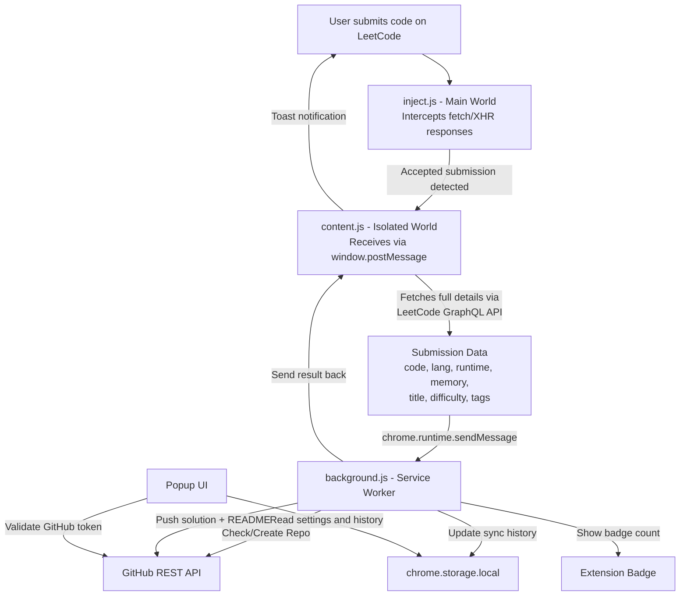

# 📋 Implementation Plan

## Architecture Overview



---

## Submission Capture Flow

LeetCode's submission process is asynchronous. Here's how we intercept it:

| Step | Endpoint | What Happens |
|------|----------|-------------|
| 1 | `POST /problems/{slug}/submit/` | User clicks Submit → returns `{ submission_id: 12345 }` |
| 2 | `GET /submissions/detail/{id}/check/` | LeetCode polls this until judging completes |
| 3 | Final check response | Returns `status_msg`, `runtime`, `memory`, `lang`, etc. |
| 4 | `POST /graphql` (submissionDetails) | We fetch the **full code + problem metadata** using the submission ID |

**Strategy**: `inject.js` hooks into `fetch()` and `XMLHttpRequest` in the main world to intercept Step 2's response. When `status_msg === "Accepted"`, we trigger the full data fetch in Step 4.

---

## Data Captured Per Submission

| Field | Source | Example |
|-------|--------|---------|
| Problem Number | URL / GraphQL | `1` |
| Problem Title | GraphQL `questionData` | `Two Sum` |
| Problem Slug | URL | `two-sum` |
| Difficulty | GraphQL | `Easy` / `Medium` / `Hard` |
| Tags/Topics | GraphQL | `['Array', 'Hash Table']` |
| Problem Description | GraphQL (HTML) | Full problem statement |
| Solution Code | GraphQL `submissionDetails` | Full source code |
| Language | Check response + GraphQL | `python3`, `cpp`, `java` |
| Runtime | Check response | `4 ms` |
| Runtime Percentile | Check response | `Beats 95.2%` |
| Memory Usage | Check response | `17.5 MB` |
| Memory Percentile | Check response | `Beats 82.1%` |
| Submission ID | Submit response | `1234567890` |
| Timestamp | Check response | `2026-06-23T12:30:00Z` |
| LeetCode Problem URL | Constructed | `https://leetcode.com/problems/two-sum/` |

---

## File-by-File Implementation Details

### 1. `manifest.json` — Extension Configuration
- **Manifest V3** with `manifest_version: 3`
- **Permissions**: `storage`, `activeTab`, `alarms` (for retry scheduling)
- **Host permissions**: `https://leetcode.com/*`, `https://api.github.com/*`
- **Content scripts**: match `https://leetcode.com/problems/*` + `https://leetcode.cn/problems/*`, run at `document_idle`
- **`web_accessible_resources`**: expose `scripts/inject.js` to `leetcode.com` for main-world injection
- **Background**: service worker → `scripts/background.js`
- **Action**: default popup → `popup/popup.html`
- **Icons**: 16, 48, 128 px

---

### 2. `scripts/inject.js` — Main World Network Interceptor
Injected into main world to bypass isolated world limitation:

- **Hooks `fetch()`**: Wraps `window.fetch` with a proxy that intercepts responses to `/submissions/detail/*/check/`
- **Hooks `XMLHttpRequest`**: Overrides `open` + `onreadystatechange` to capture XHR responses
- **Detection logic**: Parses JSON response → checks `state === "SUCCESS"` AND `status_msg === "Accepted"`
- **Extracts**: `submission_id`, `runtime`, `runtime_percentile`, `memory`, `memory_percentile`, `lang`, `status_msg`, `task_finish_time`
- **Posts to content script**: `window.postMessage({ type: 'LEETCODE_SUBMISSION_ACCEPTED', data: {...} }, '*')`
- **Deduplication**: Keeps a `Set` of recently processed submission IDs (last 20)

---

### 3. `scripts/content.js` — Orchestrator
Runs in isolated world on LeetCode problem pages:

- **Injects `inject.js`** via `<script>` tag with `chrome.runtime.getURL()`
- **Listens for `window.postMessage`**: filters for `type === 'LEETCODE_SUBMISSION_ACCEPTED'`
- **Extracts problem slug** from URL
- **Fetches problem details** via GraphQL:
  ```graphql
  query questionData($titleSlug: String!) {
    question(titleSlug: $titleSlug) {
      questionId, title, titleSlug, difficulty
      topicTags { name slug }
      content
    }
  }
  ```
- **Fetches submission code** via GraphQL:
  ```graphql
  query submissionDetails($submissionId: Int!) {
    submissionDetails(submissionId: $submissionId) {
      code, timestamp, statusDisplay
      lang { name verboseName }
      runtime, runtimePercentile
      memory, memoryPercentile
    }
  }
  ```
- **Sends combined payload** to background via `chrome.runtime.sendMessage`
- **Shows toast notification** (green success / red failure with retry)
- **Edge case handling**: auto-sync toggle check, GraphQL retry (3 attempts, 1s delay)

---

### 4. `scripts/background.js` — Service Worker
Stateless event-driven service worker:

**Message Types:**
- `SYNC_SUBMISSION` — push code to GitHub
- `VALIDATE_TOKEN` — test GitHub PAT
- `GET_SYNC_HISTORY` — return sync log
- `RETRY_FAILED` — retry from offline queue

**GitHub API Operations:**
1. **Auto-create repo**: `GET /repos/{owner}/{repo}` → 404 → `POST /user/repos`
2. **Auto-detect branch**: uses `default_branch` from repo response
3. **Push solution**: `GET` (check SHA) → `PUT` (create/update with base64 content)
4. **Push README**: structured markdown with badges, stats, description
5. **Update root README**: maintains index table of all problems

**Robustness:**
- **Offline queue**: failed pushes saved to `chrome.storage.local` → `failedQueue`
- **Retry via `chrome.alarms`**: every 5 min with exponential backoff (max 1hr)
- **Rate limit awareness**: reads `X-RateLimit-Remaining` header
- **Duplicate prevention**: checks submission_id against sync history
- **Badge updates**: shows today's sync count / red for errors

---

### 5. `popup/popup.html` — Premium Popup UI (400×550px)

**Tab 1 — Dashboard:**
- Total synced (animated counter), difficulty breakdown (progress rings)
- Today's count, streak indicator, last synced problem

**Tab 2 — History:**
- Last 50 submissions, filterable by difficulty
- Each entry: number, title, difficulty badge, language, timestamp, GitHub link
- Failed items with red indicator + "Retry" button

**Tab 3 — Settings:**
- GitHub PAT input (masked, show/hide toggle)
- Repository name, branch (auto-detected)
- Auto-sync toggle
- "Test Connection" button → validates PAT + shows username
- Status indicators (🟢 Connected / 🟡 Not set / 🔴 Invalid)
- Clear history, link to repo

---

### 6. `popup/popup.css` — Dark Glassmorphism Theme
- Background: `#0d1117` (GitHub-dark)
- Glassmorphism: `backdrop-filter: blur(12px)` with subtle borders
- Colors: Easy `#00b8a3`, Medium `#ffc01e`, Hard `#ff375f`, Accent `#58a6ff`
- Animated progress rings (CSS `conic-gradient`)
- Tab transitions, hover effects, micro-animations
- System font stack, themed scrollbars

---

### 7. `styles/toast.css` — In-Page Notifications
- Fixed bottom-right corner, glassmorphism card
- Slide-in animation, auto-dismiss (5s) with progress bar
- GitHub icon + direct link to pushed file
- z-index: 999999

---

## Supported Languages (18+)

| LeetCode ID | Extension | LeetCode ID | Extension |
|-------------|-----------|-------------|-----------|
| `python3` | `.py` | `typescript` | `.ts` |
| `python` | `.py` | `c` | `.c` |
| `cpp` | `.cpp` | `csharp` | `.cs` |
| `java` | `.java` | `go` | `.go` |
| `javascript` | `.js` | `ruby` | `.rb` |
| `swift` | `.swift` | `kotlin` | `.kt` |
| `rust` | `.rs` | `scala` | `.scala` |
| `php` | `.php` | `dart` | `.dart` |
| `racket` | `.rkt` | `erlang` | `.erl` |
| `elixir` | `.ex` | `mysql` | `.sql` |
| `pythondata` | `.py` | `react` | `.jsx` |

---

## Edge Cases & Robustness

| Scenario | Handling |
|----------|---------|
| User not logged into LeetCode | GraphQL auth error → toast: "Please log in" |
| GitHub token invalid/expired | 401 → popup red status, toast error |
| Repo doesn't exist | Auto-create via `POST /user/repos` |
| Network failure during push | Save to `failedQueue` → retry via `chrome.alarms` |
| Same problem, same language | Overwrite (GET SHA → PUT with SHA) |
| Same problem, different language | New file alongside existing |
| Rapid multiple submissions | Dedup via submission ID `Set` |
| LeetCode API changes | Fallback: extract from check response |
| Service worker killed | All state in `chrome.storage.local` |
| User disables auto-sync | Content script checks flag |
| Contest submissions | Same URL pattern — works automatically |
| LeetCode CN | Content scripts match `leetcode.cn` too |
| GitHub rate limiting | Read `X-RateLimit-Remaining`, delay if low |

---

## Security

- PAT stored in `chrome.storage.local` only — never sent except to `api.github.com`
- No external analytics or tracking
- CSP-safe injection via `web_accessible_resources`
- Token masked in popup by default
- Minimal permissions: `storage`, `activeTab`, `alarms`

---

## Verification Plan

| # | Test | Expected |
|---|------|----------|
| 1 | Load extension in Developer Mode | No manifest errors |
| 2 | Test Connection with valid PAT | 🟢 shows username |
| 3 | Test Connection with invalid PAT | 🔴 shows error |
| 4 | Submit accepted solution | Toast: "✅ Synced!" |
| 5 | Check GitHub repo | Correct folder + README + code |
| 6 | Re-submit same language | File updated (not duplicated) |
| 7 | Submit different language | New file added |
| 8 | Disable auto-sync → submit | No sync |
| 9 | Network offline → submit | Failed queue populated |
| 10 | Network restored | Auto-retry succeeds |
| 11 | First use, no repo exists | Repo auto-created |
| 12 | Check popup dashboard | Correct stats |
| 13 | Check popup history | All entries listed |
| 14 | Test Python, C++, Java, JS, Go | Correct file extensions |
| 15 | Page performance | No visible lag on LeetCode |
